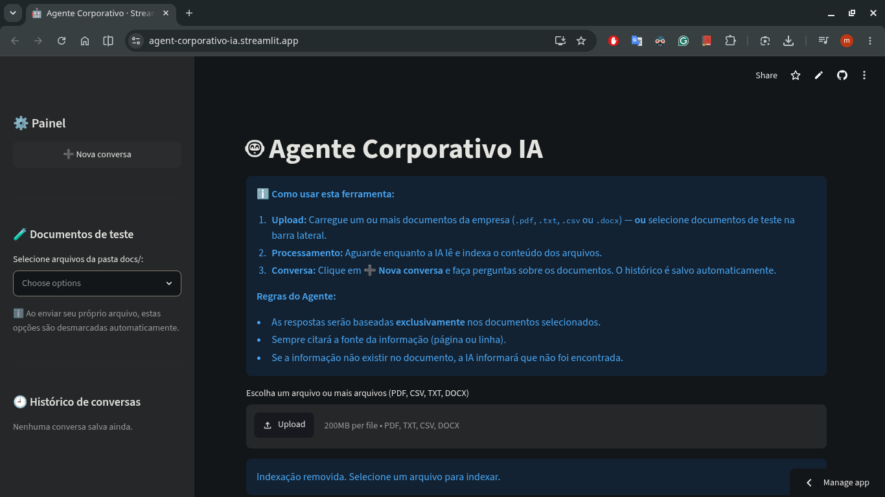
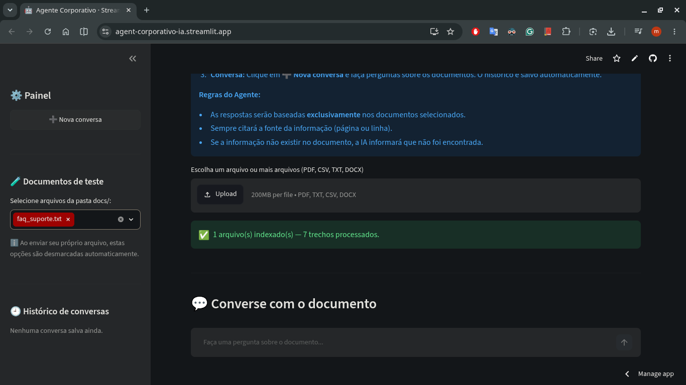
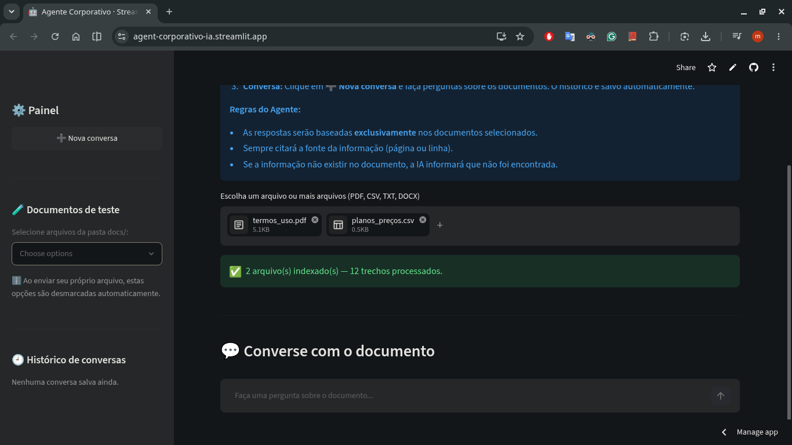
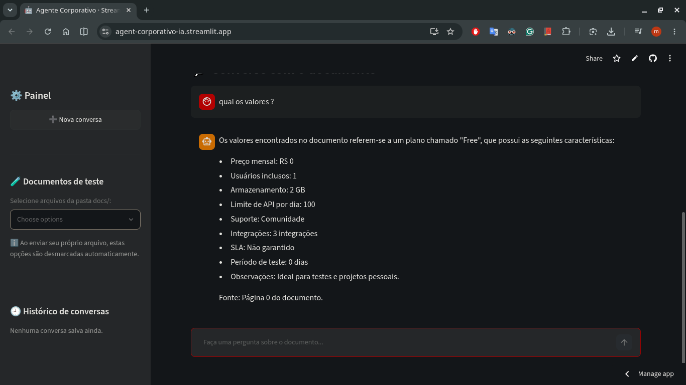
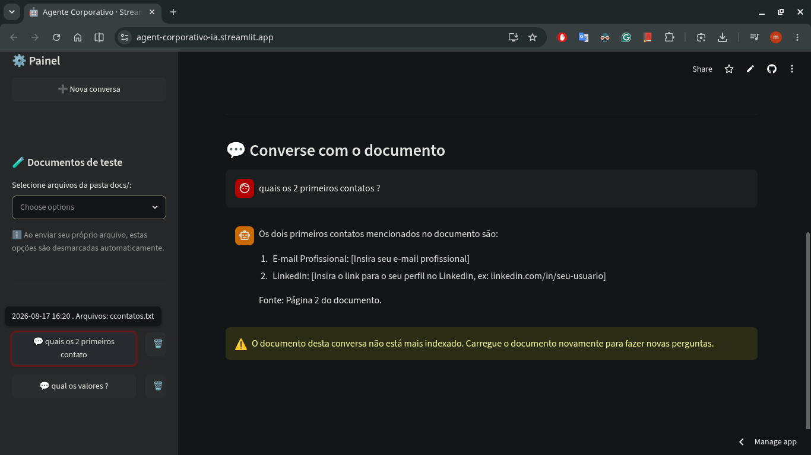

# 🤖 Agente Corporativo IA

[](https://www.python.org/)
[](https://streamlit.io/)
[](https://www.langchain.com/)

🌐 **Idiomas / Languages**: [ 🇧🇷 Português (PT-BR) ](README_pt.md) | [ 🇺🇸 English ](README.md)

---

## Descrição do Projeto

O **Agente Corporativo IA** é um assistente inteligente baseado em RAG (Geração Aumentada por Recuperação) desenvolvido para ambientes corporativos. Construído com Python, Streamlit e LangChain, ele permite que colaboradores e gestores façam upload de documentos internos (`.pdf`, `.txt`, `.csv`, `.docx`) e realizem consultas interativas em linguagem natural.

### Principais Funcionalidades
- 📄 **Suporte Multiformato**: Leitura nativa de arquivos PDF, Texto simples, CSV e DOCX — um ou vários de uma vez.
- 🎯 **Aderência Estrita ao Contexto**: Responde exclusivamente com base nos documentos fornecidos, eliminando alucinações.
- 📍 **Citação de Fonte**: Cita automaticamente a página ou linha exata de onde a informação foi extraída.
- ⚡ **Arquitetura Multi-LLM com Fallback**: Alterna automaticamente entre OpenRouter (GPT-4o mini), Groq (modelos GPT-OSS) e Google Gemini (Gemini 3.6 Flash) para garantir alta disponibilidade e menor custo.
- 💬 **Histórico Persistente (SQLite)**: Conversas e mensagens são salvas em um banco SQLite local (`chat_history.db`). Atualizar a página ou reabrir uma conversa restaura o histórico completo.
- 🕘 **Histórico de Conversas na Sidebar**: Lista conversas anteriores com botões carregar/deletar. Reabrir uma conversa que usou documentos de teste reindexa-os automaticamente.
- 🧪 **Documentos de Teste**: Arquivos de exemplo na pasta `docs/` podem ser selecionados pela sidebar — não é preciso fazer upload para experimentar o app.
- 🔍 **Detecção Automática de Delimitador CSV**: Usa `csv.Sniffer` para lidar com `,` (padrão internacional) e `;` (Excel pt-BR) automaticamente.
- ⚡ **Cache de Respostas LLM**: `InMemoryCache` evita chamadas redundantes ao LLM para prompts idênticos.

---

## Capturas de Tela

### 1. Tela Inicial


### 2. Selecionando Documentos de Teste na Sidebar


### 3. Upload de Múltiplos Documentos


### 4. Fazendo uma Pergunta e Recebendo a Resposta com Citação de Fonte


### 5. Histórico de Conversas na Sidebar


---

## Arquitetura

O sistema utiliza um pipeline de RAG orquestrado pelo LangChain e Streamlit:

```
                  +-----------------------+
                  | Upload de Documento   |
                  | (.pdf/.txt/.csv/.docx)|
                  +-----------+-----------+
                              |
                              v
                  +-----------------------+
                  |  Carregador de Docs   |
                  | (PyPDF/Text/CSV/Docx) |
                  +-----------+-----------+
                              |
                              v
                  +-----------------------+
                  |  Divisor de Texto     |
                  | Chunk: 1000 | Overlap: 200|
                  +-----------+-----------+
                              |
                              v
                  +-----------------------+
                  | Embeddings HuggingFace|
                  | (all-MiniLM-L6-v2)    |
                  | (local, grátis, sem chave)|
                  +-----------+-----------+
                              |
                              v
                  +-----------------------+
                  | Banco Vetorial(FAISS) |
                  +-----------+-----------+
                              |
  +------------------+         |
  | Pergunta Usuário |-------->+
  +------------------+         |
                              v
                  +-----------------------+
                  | Ferramenta RAG        |
                  | (buscar_no_documento) |
                  +-----------+-----------+
                              |
                              v
                  +-----------------------+
                  | Agente React LangChain|
                  +-----------+-----------+
                              |
            +-----------------+-----------------+
            |                 |                 |
            v                 v                 v
     +--------------+  +--------------+  +--------------+
     | OpenRouter   |  | Groq         |  | Google Gemini|
     | (Principal)  |->| (Fallback 1) |->| (Fallback 2) |
     +--------------+  +--------------+  +--------------+
                              |
                              v
                  +-----------------------+
                  | Resposta + Citação    |
                  +-----------+-----------+
                              |
                              v
                  +-----------------------+
                  | Persistência SQLite   |
                  | (chat_history.db)     |
                  +-----------------------+
```

### Etapas do Fluxo
1. **Carregamento**: Os arquivos enviados são processados pelo carregador correspondente (`PyPDFLoader`, `TextLoader`, `CSVLoader`, `Docx2txtLoader`). Múltiplos arquivos são processados em loop.
2. **Divisão (Chunking)**: O conteúdo é particionado em blocos de texto usando `RecursiveCharacterTextSplitter` (tamanho: 1000 caracteres, sobreposição: 200 caracteres).
3. **Indexação Vetorial**: Os trechos são convertidos em vetores via **Embeddings HuggingFace** (`sentence-transformers/all-MiniLM-L6-v2`) — modelo local e gratuito, sem chave de API — e armazenados no banco FAISS em memória. O modelo de embeddings (~90 MB) é baixado na primeira execução e fica em cache.
4. **Recuperação e Resposta**: Ao receber uma dúvida, o Agente executa a ferramenta `buscar_no_documento`, consulta o FAISS recuperando os 3 trechos mais relevantes e gera uma resposta contextualizada contendo a citação da fonte.
5. **Persistência SQLite**: Toda pergunta do usuário e resposta do agente é salva em `chat_history.db`. Conversas podem ser reabertas pela sidebar; as que usaram documentos de teste da pasta `docs/` são reindexadas automaticamente.

---

## Tecnologias Utilizadas

- **Linguagem**: Python 3.10+
- **Interface Web**: [Streamlit](https://streamlit.io/)
- **Orquestração de IA**: [LangChain](https://www.langchain.com/) / [LangChain Core](https://python.langchain.com/)
- **Banco Vetorial**: [FAISS (Facebook AI Similarity Search)](https://github.com/facebookresearch/faiss)
- **Embeddings**: [HuggingFace Embeddings](https://huggingface.co/sentence-transformers/all-MiniLM-L6-v2) (`all-MiniLM-L6-v2`) — local, gratuito, sem chave de API
- **Persistência**: `sqlite3` (built-in do Python) para histórico de chat — sem banco externo
- **Integração com LLMs** (pelo menos uma obrigatória; as demais são fallback automático):
  - [OpenRouter](https://openrouter.ai/) (`openai/gpt-4o-mini`) — Modelo Principal
  - [Groq](https://groq.com/) (`openai/gpt-oss-120b`, `openai/gpt-oss-20b`) — Fallback de Alta Velocidade
  - [Google Generative AI](https://ai.google.dev/) (`gemini-3.6-flash`) — Fallback de Segurança
- **Manipulação de Arquivos**: `pypdf`, `docx2txt`, `python-dotenv`

---

## Instruções de Instalação (Local)

### Pré-requisitos
- Python 3.10 ou superior instalado.
- Git instalado.
- Pelo menos uma chave de API de LLM (OpenRouter, Groq ou Google Gemini). **Não é necessária chave da OpenAI** — os embeddings rodam localmente via HuggingFace.

### Passo a Passo de Configuração

1. **Clonar o repositório:**
   ```bash
   git clone https://github.com/SEU_USUARIO/agente-corporativo-ia.git
   cd agent-corporativo-ia
   ```

2. **Criar e ativar um ambiente virtual:**
   - **Linux / macOS:**
     ```bash
     python3 -m venv .venv
     source .venv/bin/activate
     ```
   - **Windows:**
     ```cmd
     python -m venv .venv
     .venv\Scripts\activate
     ```

3. **Instalar as dependências:**
   ```bash
   pip install -r requirements.txt
   ```

4. **Configurar as Variáveis de Ambiente:**
   Copie o modelo de arquivo `.env`:
   ```bash
   cp .env.example .env
   ```
   Abra o arquivo `.env` no seu editor de texto e insira suas chaves de API (pelo menos uma):
   ```env
   # Provedor LLM Principal
   OPENROUTER_API_KEY=sua_chave_openrouter_aqui

   # Provedores LLM de Fallback (Opcionais, mas recomendados)
   GROQ_API_KEY=sua_chave_groq_aqui
   GEMINI_API_KEY=sua_chave_gemini_aqui
   ```
   > ℹ️ **Não precisa de `OPENAI_API_KEY`.** Os embeddings usam o `all-MiniLM-L6-v2` da HuggingFace, que roda localmente e é gratuito.

5. **Executar a aplicação Streamlit:**
   ```bash
   streamlit run app.py
   ```
   A aplicação será aberta no navegador em `http://localhost:8501`.

   Na primeira execução, o modelo de embeddings da HuggingFace (~90 MB) é baixado automaticamente e fica em cache para as próximas execuções.

---

## Deploy no Streamlit Cloud

O app foi projetado para funcionar no [Streamlit Community Cloud](https://streamlit.io/cloud) **sem nenhuma alteração de código**. A função `get_secret()` lê de `st.secrets` (Cloud) primeiro e, em seguida, faz fallback para `os.environ` (`.env` local).

### Passo a Passo do Deploy

1. **Faça o push do código** para um repositório público no GitHub.
2. **Acesse** [share.streamlit.io](https://share.streamlit.io) e entre com sua conta GitHub.

3. **Crie um novo app:**
   - **Repositório**: `link do repositorio público no github`
   - **Branch**: `nome da branch`
   - **Caminho do arquivo principal**: `nome do arquivo principal da aplicacao`

4. **Configure os Secrets (chaves de API):**
   - Clique em **Settings ⚙️** → **Secrets**
   - Cole suas chaves no formato **TOML** (sem arquivo `.env` no Cloud):
     ```toml
     OPENROUTER_API_KEY = "sua_chave_key"
     GROQ_API_KEY = "sua_chave_key"
     GEMINI_API_KEY = "sua_chave_key"
     ```
   - Pelo menos **uma** chave é obrigatória; as demais funcionam como fallback automático.

5. **Clique em Deploy.** O primeiro deploy baixa o modelo de embeddings da HuggingFace (~90 MB), então pode levar alguns minutos para iniciar.

### Como os Secrets Funcionam no Streamlit Cloud

| Desenvolvimento local | Streamlit Cloud |
|---|---|
| Arquivo `.env` carregado por `python-dotenv` | `st.secrets` configurado no dashboard |
| `os.environ` | `st.secrets` (formato TOML) |
| Ambos lidos por `get_secret()` em `app.py:45` | Ambos lidos por `get_secret()` em `app.py:45` |

A função `get_secret()` lida com ambos os ambientes de forma transparente:
```python
def get_secret(key: str) -> str | None:
    try:
        return st.secrets[key]       # Streamlit Cloud
    except (KeyError, FileNotFoundError):
        return os.getenv(key)        # .env local
```

> ⚠️ **Nunca faça commit do arquivo `.env`.** Ele está listado no `.gitignore`. No Streamlit Cloud, os secrets são criptografados e armazenados separadamente do repositório.

---

## Exemplos de Perguntas

Com base nos documentos demonstrativos da pasta [`docs/`](docs/):

1. **FAQ / Cadastro de Conta** (`docs/faq_suporte.txt`):
   > *"Como faço para criar uma conta na Nexolve e quanto tempo dura o período de testes?"*

2. **Planos e Preços** (`docs/planos_preços.csv`):
   > *"Quais são os limites e o valor do plano Business em comparação ao plano Pro?"*

3. **Pergunta Fora do Escopo** (Teste de prevenção a alucinações):
   > *"Qual é a fórmula de cálculo para o bônus anual de desempenho dos funcionários?"*

---

## Exemplos de Respostas

### Resposta à Pergunta 1:
**Usuário:** *"Como faço para criar uma conta na Nexolve e quanto tempo dura o período de testes?"*
**Agente:**
> Para criar uma conta na Nexolve:
> 1. Acesse https://app.nexolve.com.br.
> 2. Clique em "Criar conta".
> 3. Preencha o formulário com nome, e-mail corporativo e senha.
> 4. Insira o código de confirmação recebido por e-mail.
>
> Após a confirmação, sua conta estará ativa no plano Free com **14 dias de trial do plano Pro** (sem necessidade de cartão de crédito).
>
> **Fonte:** Linhas 16 a 24 do documento `docs/faq_suporte.txt`.

---

### Resposta à Pergunta 2:
**Usuário:** *"Quais são os limites e o valor do plano Business em comparação ao plano Pro?"*
**Agente:**
> Com base na tabela de preços:
> - **Plano Pro:** Custa **R$ 89/usuário/mês**, inclui **10 usuários**, **50 GB de armazenamento**, **10.000 requisições de API por dia**, 15 integrações e SLA de 99,5% de uptime.
> - **Plano Business:** Custa **R$ 249/usuário/mês**, inclui **25 usuários**, **250 GB de armazenamento**, **100.000 requisições de API por dia**, 30 integrações e SLA de 99,9% de uptime.
>
> **Fonte:** Linha 3 (Pro) e Linha 4 (Business) do documento `docs/planos_preços.csv`.

---

### Resposta à Pergunta 3 (Fora do Escopo):
**Usuário:** *"Qual é a fórmula de cálculo para o bônus anual de desempenho dos funcionários?"*
**Agente:**
> A informação solicitada não consta no documento fornecido.
>
> **Fonte:** Busca realizada no documento via `buscar_no_documento`.
